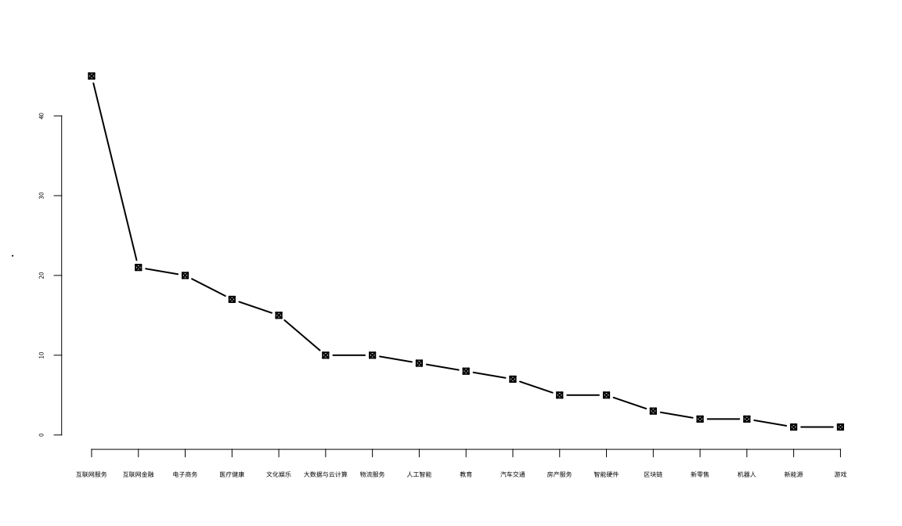
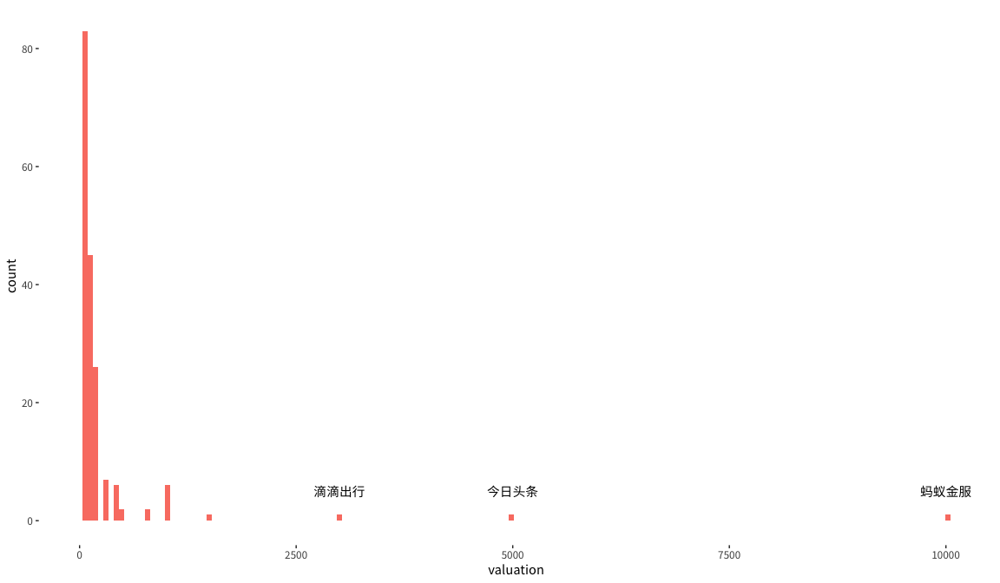
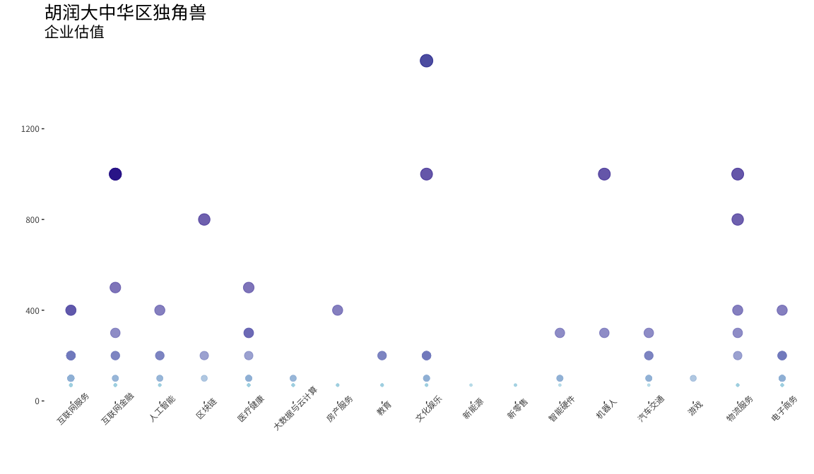
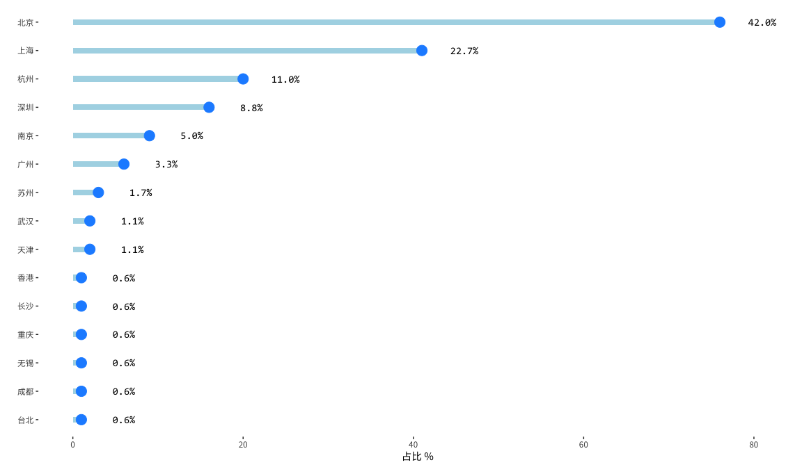
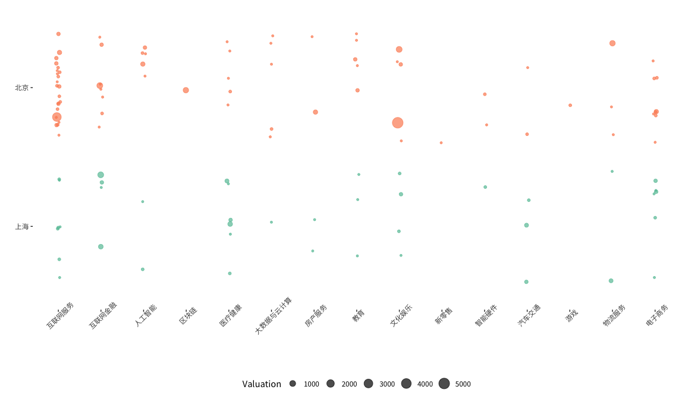
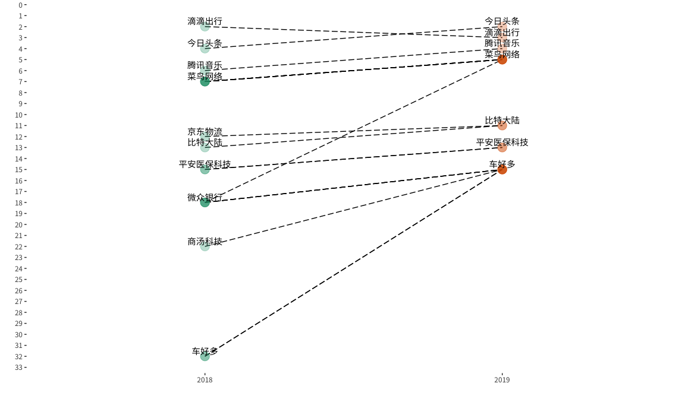

Knowbox Data Analyst Level 1 Exam
================

胡润研究院每个季度都会发布《胡润大中华区独角兽指数》，针对估值超过 10 亿美金的企业进行排名。这份练习将利用此数据探索国内当前的互联网格局。

数据已经过清洗与处理，储存于 `raw.csv`，包含了以下维度,

    1. ranking # 排名
    2. ranking_chg # 排名变化
    3. name_zh # 企业名称
    4. name_en # 企业英文名称
    5. valuation # 估值
    6. key_person # 掌门人
    7. headquarter # 总部
    8. industry # 行业
    9. investors # 部分投资机构

-----

#### 行业的热度

赛道决定了资本市场的上线。我们优先按行业对企业分组，由高至低看看各个行业的占比。

提示：如果使用 `graphics::plot`，建议调整字体大小 `cex.axis = 0.5`

<!-- -->

除了数量以外，让我们看看各个行业内的企业估值。在具体操作之前，我们先探索估值的分布以排除任何可能出现的离群点。

<!-- -->

可以看出，前 3 名企业的估值大大压缩了估值的分布，针对以下图表我们选择把他们移除在外。为了提高可视化的表达性，我们也将对大小属性 `size`
以及颜色属性 `color` 进行对数转换。

提示：可以使用 `dplyr::slice` 对行进行定位并移除。

 

<!-- -->

#### 地域的差异

大家都说北京是中国的互联网之都，话不多说，上图。

<!-- -->

如果对比北京与上海，领域的分布是否一致？

提示：关于配色使用 `scale_color_brewer(palette = "Set2")`

<!-- -->

#### 排名的变化

延续我们上面针对地域的探索，哪些城市具有数量上升或下降的趋势？哪些城市孵化最多的明日之星？

提示：使用正则表达式 `\\d+` 代表多个数字符号，`\\W`
代表非字母或非数字

 

| 排名 | 上海 | 北京 | 南京 | 台北 | 天津 | 广州 | 成都 | 无锡 | 杭州 | 武汉 | 深圳 | 苏州 | 重庆 | 长沙 | 香港 |
| :- | -: | -: | -: | -: | -: | -: | -: | -: | -: | -: | -: | -: | -: | -: | -: |
| 上升 | 24 | 43 |  4 |  0 |  2 |  5 |  0 |  0 | 10 |  1 | 11 |  2 |  0 |  0 |  0 |
| 下降 |  9 | 20 |  3 |  0 |  0 |  0 |  0 |  1 |  6 |  0 |  2 |  1 |  1 |  1 |  0 |
| 新星 |  8 | 13 |  2 |  1 |  0 |  1 |  1 |  0 |  3 |  1 |  3 |  0 |  0 |  0 |  1 |

 

筛选排名前20的企业，对比他们 2018 至 2019 的变化，整体呈现的趋势是什么？

提示：可以选择不显示所有公司的名字以避免文字重叠 `geom_text(check_overlap = TRUE)`

 

<!-- -->
